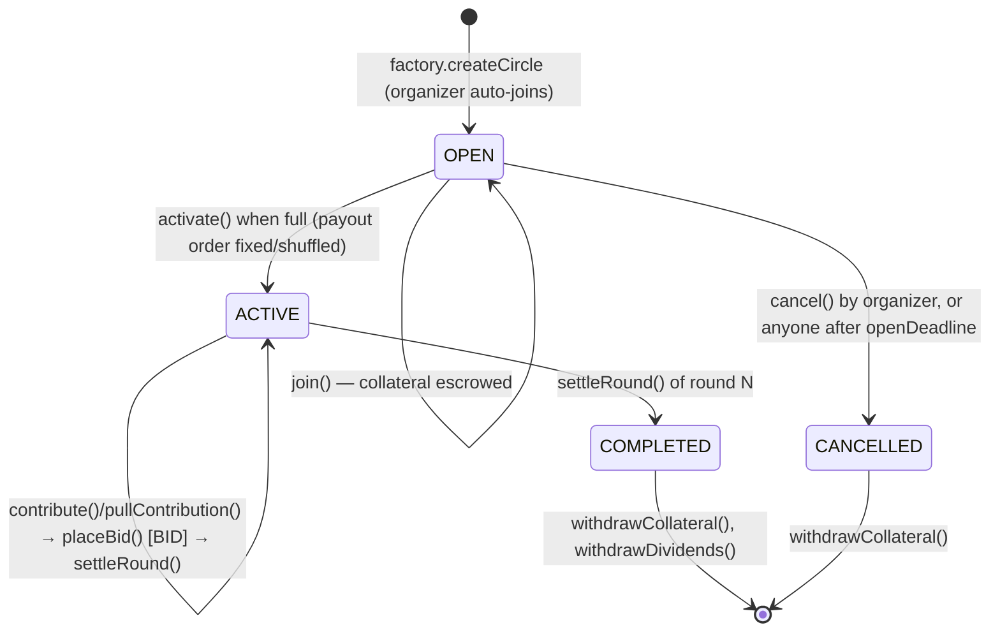
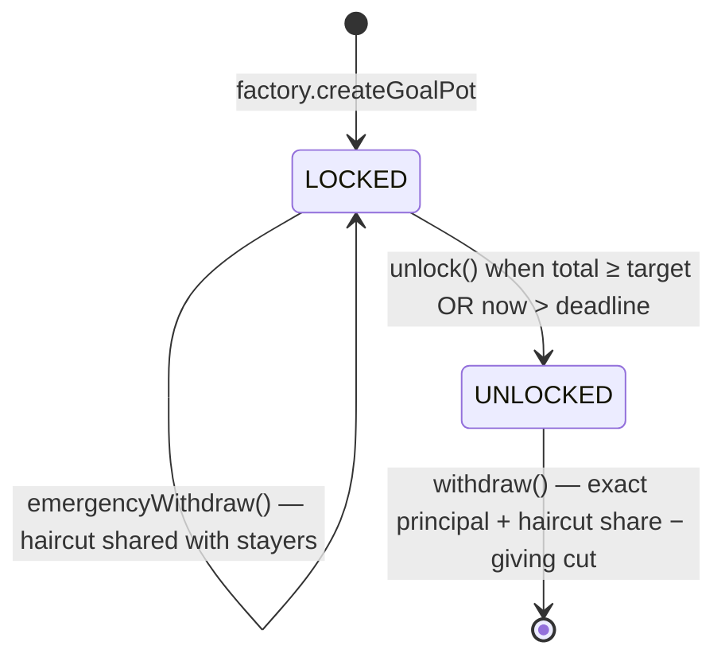

# Rota ◎ — Global Group Savings & Rotating Credit on Arc

> *rota* (Latin): wheel. **Your turn always comes.**

The world has always saved in circles — *somiti* (Bangladesh), *chit fund/kameti*
(India, Pakistan), *tanda* (Mexico), *susu* (Ghana, Caribbean), *esusu/ajo* (Nigeria),
*hui* (China), *paluwagan* (Philippines), *gam'eya* (Egypt). Rota puts them all on one
set of rails: smart-contract escrowed savings circles in USDC on
[Arc](https://docs.arc.io), Circle's stablecoin-native L1.

**Beachhead market: Bangladesh** — complete Bangla UI, taka amounts on every screen,
somiti-native copy, and diaspora corridors (Dubai/KSA/Malaysia/UK/US → Dhaka). New
markets are configuration, not refactoring (see [Adding a locale/currency](#adding-a-localecurrency)).

## Products

| Product | What it is |
|---|---|
| **Rota Circle** | Classic ROSCA: N members pay a fixed USDC amount per round; each round one member takes the whole pot (fixed or random order). |
| **Bid Circle** | Chit-fund mode: members who haven't won bid a *discount* to take the pot early; the discount is redistributed to everyone as a dividend — a market price for liquidity. |
| **Goal Pot** | Non-rotating group saving toward a target (wedding, tuition, Eid, land). Locks until target/deadline; everyone withdraws exactly their own deposits. |

Cross-cutting: contract escrow (no absconding organizer), deterministic payouts,
collateral + default curing, non-custodial **AutoPay**, optional **Giving round**
(labeled Zakat/Sadaqah in `bn`/`ur`), and an on-chain **Credit Passport** reputation
score for thin-file users.

## Repository layout

```
rota/
├── contracts/            Foundry project (Solidity 0.8.24, OpenZeppelin 5)
│   ├── src/              RotaFactory, RotaCircle, GoalPot, ReputationRegistry
│   ├── test/             66 tests: happy paths, bids, autopay, defaults, fuzz, invariants, reentrancy
│   └── script/           DeployLocal / DeployArc (+ script/config/ArcConfig.sol)
├── app/                  Vite + React 18 + TS + Tailwind + wagmi v2/viem + i18next
│   └── src/
│       ├── config/       chain.ts (single source of chain truth), currencies.ts
│       ├── abi/          AUTO-GENERATED by scripts/abi-sync.mjs
│       └── i18n/         en + bn complete; es/hi/ur/tl scaffolds
├── scripts/              abi-sync.mjs, seed-local.mjs
├── docs/                 ARC_NOTES.md (researched chain values), DECISIONS.md
└── SECURITY.md           honest limitations — read it
```

## Prerequisites

- [Foundry](https://book.getfoundry.sh/getting-started/installation) (`forge`, `anvil`)
- Node ≥ 20, [pnpm](https://pnpm.io)
- A browser wallet (MetaMask) for the UI

## Quickstart (local)

```bash
pnpm install

# terminal 1 — local chain
pnpm chain

# terminal 2 — deploy + wire the app + demo data
pnpm deploy:local     # MockUSDC + registry + implementations + factory,
                      # writes app/src/config/deployments.local.json, syncs ABIs
pnpm seed:local       # demo: ROSCA with 2 rounds played, bid circle mid-auction,
                      # goal pot at 60% — instantly demo-able
pnpm dev              # app at http://localhost:5173
```

In MetaMask: add network `http://127.0.0.1:8545` (chain id 31337) and import anvil
account #0 (`0xac09…ff80` private key printed by anvil). Accounts #0–#3 are members
of the seeded circles. The header has a **Mint 1,000 test USDC** button on anvil.

Run the contract suite:

```bash
pnpm test:contracts    # forge test — 66 tests, all green
```

## Deploying to Arc testnet

Chain values were researched from docs.arc.io and recorded in
[docs/ARC_NOTES.md](docs/ARC_NOTES.md): chain id **5042002**, RPC
`https://rpc.testnet.arc.network`, explorer `https://testnet.arcscan.app`, USDC =
native gas token with an ERC-20 interface at `0x3600…0000` (6 decimals).

1. Fund a deployer wallet with testnet USDC at <https://faucet.circle.com>
   (gas on Arc is paid in USDC).
2. `cp .env.example .env` and set `PRIVATE_KEY`.
3. ```bash
   export PRIVATE_KEY=0x…
   pnpm deploy:arc          # deploys registry/implementations/factory, syncs ABIs
   ```
4. Run the app against Arc: `VITE_CHAIN=arc pnpm dev` (or set it in `.env`).

## Architecture

### RotaCircle state machine



Per active round: members contribute before the schedule-anchored deadline (AutoPay
lets anyone trigger an opted-in member's exact contribution); in BID mode an auction
runs during the first `bidWindowBps` of the round; `settleRound()` slashes defaulter
collateral, pays the optional giving cut, pays the recipient (order-based or winning
bidder minus discount), credits bid dividends pull-withdrawably, and reports
everything to the ReputationRegistry.

### GoalPot state machine



### Reputation

Only factory-deployed clones can write. Transparent score:
`completions×100 + contributions×10 + cures×20 − defaults×50 − earlyExits×15`
(floored at 0). The frontend renders a shareable **Credit Passport** page per address
with QR, history, and client-side signature verification — no backend.

## Feature matrix

| Feature | MVP | Future |
|---|---|---|
| ROSCA / bid / goal-pot products | ✅ | |
| Collateral, default slashing, curing | ✅ | multi-round collateral |
| Non-custodial AutoPay | ✅ | protocol keeper network |
| Giving round (Zakat/Sadaqah) | ✅ | |
| Reputation registry + passport page | ✅ | soul-bound token passport |
| en + bn locales, 7 display currencies | ✅ | es/hi/ur/tl translations |
| In-app + browser deadline reminders | ✅ | Telegram/WhatsApp bots |
| Random order via blockhash | ✅ (documented) | Chainlink VRF |
| Local anvil + Arc testnet | ✅ | mainnet (post-audit, post-legal) |
| Fiat ramps (bKash/Nagad, UPI, M-Pesa, GCash) | — | per-market integrations |
| Arc App Kit Unified Balance / Bridge deposits | — | chain-abstracted funding |
| Emergency micro-advances against reputation | — | research |
| AI organizer agent, mobile app | — | research |

## Adding a locale/currency

New markets are pure configuration:

1. **Locale**: copy `app/src/i18n/en.json` to `<code>.json`, translate every key,
   register it in `app/src/i18n/index.ts` (`SUPPORTED_LOCALES` + `resources`).
   Missing keys automatically fall back to English, so partial translations ship
   safely. Scaffolds for `es`, `hi`, `ur`, `tl` already exist.
2. **Display currency**: add one entry to `CURRENCIES` in
   `app/src/config/currencies.ts` (ISO code, symbol, `Intl` locale, name key) and, if
   the new locale should default to it, one line in `LOCALE_DEFAULT_CURRENCY`.
   Rates come from the swappable `RATE_PROVIDER` (free FX API, cached, display-only —
   on-chain money is always USDC).
3. Localized product terminology (e.g. the giving label "Zakat/Sadaqah" vs "Giving")
   lives entirely in the locale file — contracts are locale-agnostic by design.

## Security

Read [SECURITY.md](SECURITY.md). Highlights: blockhash randomness is
validator-influenceable (bounded impact), collateral can under-cover repeat defaults,
AutoPay rests on standard ERC-20 allowances, FX rates are indicative, and there is no
KYC/regulatory layer — pooled savings face financial regulation that varies by
country, so **Rota stays on testnet until reviewed per market**.

## License

MIT (contracts and app). Not audited. Not financial advice.
# Rota
